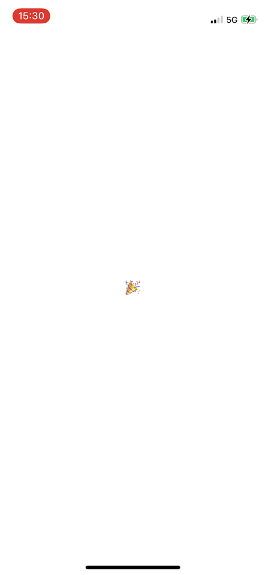

# XSConfettiDemo

## ⚠️Warn

This demo uses the CAEmitterBehavior class.

CAEmitterBehavior is a (mostly?) undocumented class that dramatically increases the power of CAEmitterLayer. It allows for the addition of unique particle behaviors that make for some interesting effects individually — but when combined with other behaviors and carefully-picked animations, can drive amazing effects (like iMessage's fantastic confetti implementation).

Because it's an undocumented class, you should not be using it in a production app, and it probably doesn't deserve that much attention overall.

## 📚Reference

[Recreating iMessage Confetti](https://bryce.co/recreating-imessage-confetti/)

